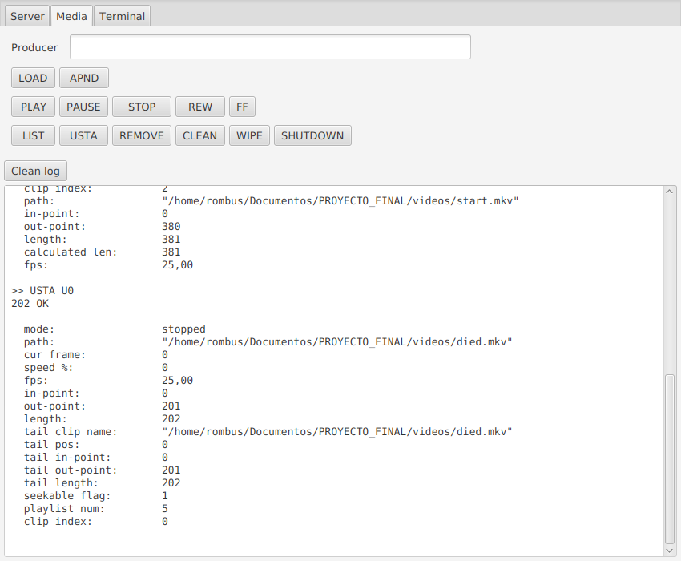

# limited-melted-gui
Graphical telnet client for the Melted server.

Tool for testing purposes.

It supports drag&drop files to text input areas for a faster workflow.

Download the jar file from https://github.com/Rombusevil/limited-melted-gui/releases/.
Run it with "java -jar LMG.jar" command.

  

