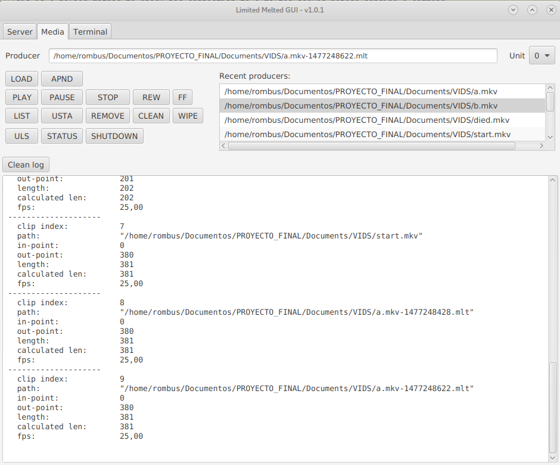

# limited-melted-gui
Graphical telnet client for the Melted server.

Tool for testing purposes. Works by default with the "U0" unit.

It supports drag&drop files to text input areas for a faster workflow.

  

